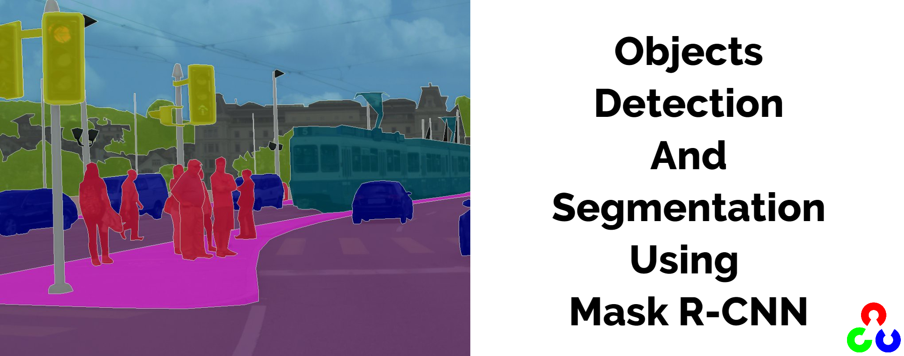
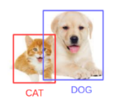
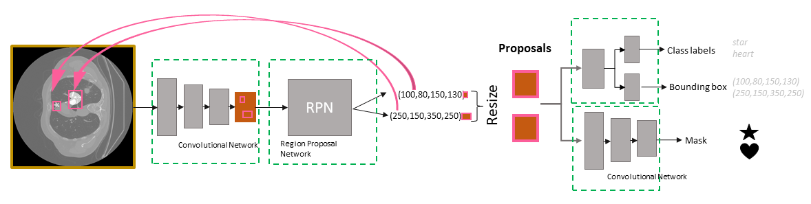

<!-- PROJECT TITLE -->
<h1 align="center">Objects detection and segmentation using Mask R-CNN</h1>

<!-- HEADER -->
<p align="center">
  
</p>

<!-- PROJECT DESCRIPTION -->
## <br>**➲ Project description**
Apply objects detection and segmentation using Mask R-CNN model

<!-- PREREQUISTIES -->
## <br>**➲ Prerequisites**
This is list of required packages and modules for the project to be installed :
* <a href="https://www.python.org/downloads/" target="_blank">Python 3.x</a>
* Numpy
* OpenCV

Install all required packages :
 ```sh
  pip install -r requirements.txt
  ```

<!-- THE Model -->
## <br>**➲ The Model**
Mask R-CNN is basically an extension of Faster R-CNN. Faster R-CNN is widely used for object detection tasks. For a given image, it returns the class label and bounding box coordinates for each object in the image. So, let’s say you pass the following image:<br>
<br>
The Fast R-CNN model will return something like this:<br>
<br>
The Mask R-CNN framework is built on top of Faster R-CNN. So, for a given image, Mask R-CNN, in addition to the class label and bounding box coordinates for each object, will also return the object mask.<br>
Let’s first quickly understand how Faster R-CNN works. This will help us grasp the intuition behind Mask R-CNN as well.

  - Faster R-CNN first uses a ConvNet to extract feature maps from the images
  - These feature maps are then passed through a Region Proposal Network (RPN) which returns the candidate bounding boxes
  - We then apply an RoI pooling layer on these candidate bounding boxes to bring all the candidates to the same size
  - And finally, the proposals are passed to a fully connected layer to classify and output the bounding boxes for objects
Once you understand how Faster R-CNN works, understanding Mask R-CNN will be very easy. So, let’s understand it step-by-step starting from the input to predicting the class label, bounding box, and object mask.

<br><br>
So the mask rcnn has main stages :
  - The backbone model which is a simple classifier model
  - Region Proposal Network (RPN) which needs to find the Regions of Interests (ROI). For this it predicts 4 coordinates, and a label to each anchor.<br>
  - Region of Interest (RoI)
The regions obtained from the RPN might be of different shapes, right? Hence, we apply a pooling layer and convert all the regions to the same shape. Next, these regions are passed through a fully connected network so that the class label and bounding boxes are predicted.<br>
  - Segmentation Mask
Once we have the RoIs based on the IoU values, we can add a mask branch to the existing architecture. This returns the segmentation mask for each region that contains an object. It returns a mask of size 28 X 28 for each region which is then scaled up for inference.<br>
  
<!-- INSTALLATION -->
## ➲ Installation
1. Clone the repo
   ```sh
   git clone https://github.com/omaarelsherif/Objects-Detection-And-Segmentation-Using-Mask-RCNN.git
   ```
2. Run the code from cmd
   ```sh
   python detect.py "IMAGE_PATH"
   ```
   For example:
   ```sh
   python detect.py Images/img1.jpg
   ```

<!-- OUTPUT -->
## <br>**➲ Output**
Now let's see the project output after running the code :

**The input image :**<br>
<br><br>

**Object detection :**<br>
<br><br>

**Segmentation masks :**<br>
<br><br>

**Object detection and segmentation :**<br>
<br>

<!-- REFERENCES -->
## <br>**➲ References**
These links may help you to better understanding of the project idea and techniques used :
1. Image Segmentation Using Deep Learning : https://bit.ly/2XKnoJM
2. Mask R-CNN for Image Segmentation : https://bit.ly/3nwAiUr

<!-- CONTACT -->
## <br>**➲ Contact**
- E-mail   : [omaarelsherif@gmail.com](mailto:omaarelsherif@gmail.com)
- LinkedIn : https://www.linkedin.com/in/omaarelsherif/
- Facebook : https://www.facebook.com/omaarelshereif
